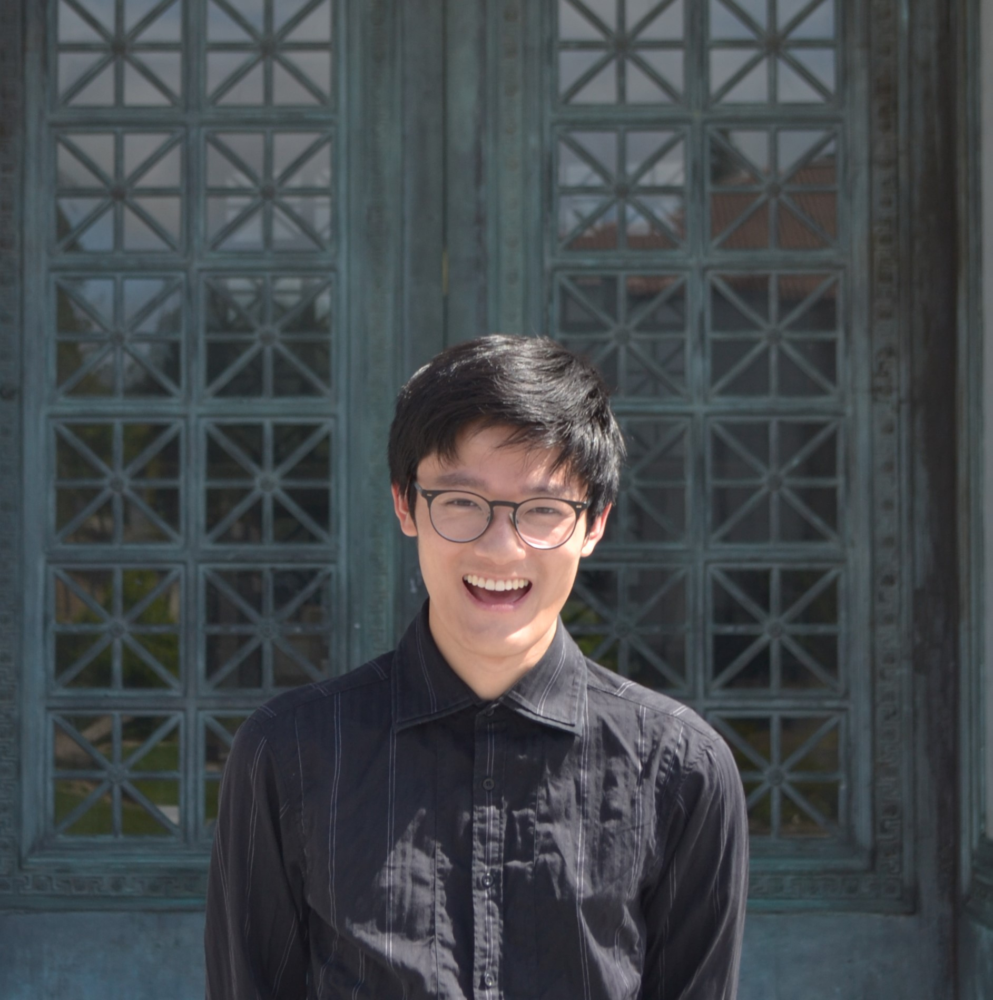

# Curriculum Vitae

I suppose if you care about traditional credentials

	

	I grew up in the Bay Area where everyone dreams of entering big tech or startups. 
	I think I just really wanted a unique path and avoid the "beaten path" with my life; 
	it was certainly more adventurous.

 
	I suppose I'm somewhat of a researcher/engineer by trade and by gravity.

	<a href="https://linkedin.com/in/curtisjhu" style="color: navy;">linkedin</a> • 
	<a href="https://funnyscar.com" style="color: navy;">funnyscar</a> •
	<a href="https://curthu.com" style="color: navy;">curthu</a>

## Selected Works at a Glance

## Education

- 2026 -- B.A. Physics and Computer Science, University of California, Berkeley

## Work Experience

- Apr - July 2026 -- Software (Infrastructure) Engineer, United States Treasury
- May - Aug 2025 -- Quantitative Finance Intern, Tanius Technology LLC
- May - Aug 2024 -- Computational Physics Intern, Lawrence Livermore National Laboratory (LLNL)

## Selected Publications
-  

## Teaching

Hiatus from Traditional Academia

- Teaching Assistant for Computer Graphics (CS184) at UC Berkeley, Summer 2025
- Teaching Assistant for Intro to Artificial Intelligence (CS188) at UC Berkeley, Summer 2024
- Teaching Assistant for Intro to Optics, Relativity, Quantum Mechanics (PHYS 7C) at UC Berkeley, Fall 2024
- Teaching Assistant for E&M and Thermodynamics (PHYS 7B) at UC Berkeley, Fall 2024
- Teaching Assistant for CS88C at UC Berkeley, Fall 2023

<!-- ## Awards -->

<!-- ## Guest Lectures -->

<!-- ## Tutorials -->

<!-- ## Patents -->
