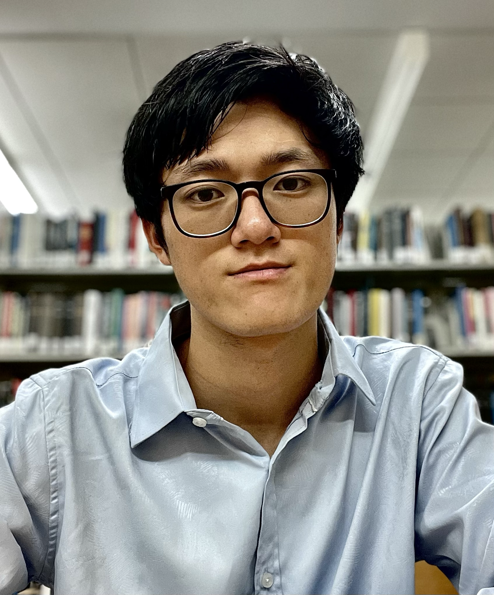

Hey I'm Curtis. I'm currently working for the United States Treasury building a modern infrastructure. 

I studied Physics/CS at <a href="https://physics.berkeley.edu/">University of California, Berkeley</a>

Previously, I've worked in <a href="https://www.tanius.com/">Quant Finance</a> and on <a href="https://www.energy.gov/articles/doe-national-laboratory-makes-history-achieving-fusion-ignition">fusion ignition</a> experiments at <a href="https://www.llnl.gov/">Lawrence Livermore National Laboratory.</a>

<!-- Show off some work -->

<!-- Teaching -->
<!-- Who I worked with, big names preferably -->

<!--
I've also have the opportunity to teach different courses such as <a href="https://cs184.eecs.berkeley.edu/su25/staff/">Computer Graphics (CS184)</a>, <a href="https://inst.eecs.berkeley.edu/~cs188/su24/staff/">Intro to Artificial Intelligence (CS188)</a> and <a href="">Intro to Optics, Relativity, Quantum Mechanics (PHYS 7C)</a>.
-->

<!-- Hobbies, show that you're human and easy to get along and that they should reach out -->
My go to activity to cope is either building something, sleeping, or <a href="https://www.strava.com/athletes/46936459">running</a>. Been a moderately consistent <a href="https://www.goodreads.com/curtisjhu
">reader</a> or I just ask Chat endless questions.

<a href="https://bucket.funnyscar.com/resumes/resume-jan.pdf" style="color: navy;">resume</a> • 
<a href="https://github.com/curtisjhu" style="color: navy;">github</a> • 
<a href="https://linkedin.com/in/curtisjhu" style="color: navy;">linkedin</a> • 
<a href="https://funnyscar.com" style="color: navy;">funnyscar</a>

Last updated 10/2/2025
