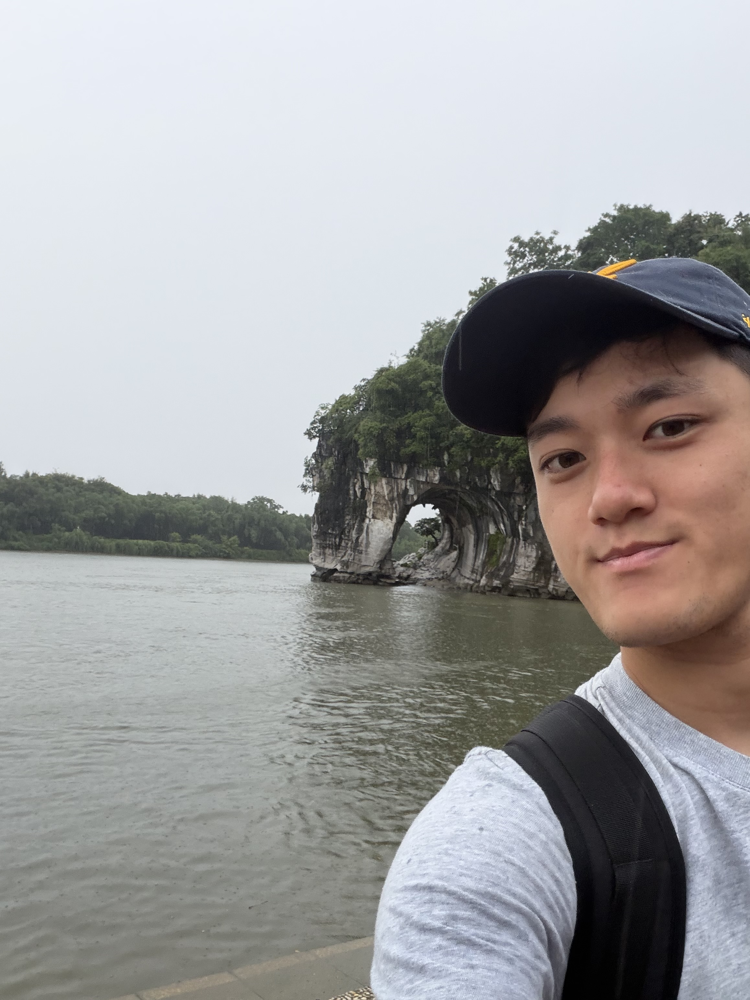

Hey I'm Curtis. I'm currently working for the United States Treasury building a modern tech infrastructure. 

I studied Physics/CS at <a href="https://physics.berkeley.edu/">University of California, Berkeley</a>

Previously, I've worked on statistical analysis (q finance) at <a href="https://www.tanius.com/">Tanius LLC</a> and on <a href="https://www.energy.gov/articles/doe-national-laboratory-makes-history-achieving-fusion-ignition">scientific simulations</a> for design physicists at <a href="https://www.llnl.gov/">LLNL</a>

<!-- Show off some work -->

<!-- Teaching -->
<!-- Who I worked with, big names preferably -->

<!--
I've also have the opportunity to teach different courses such as <a href="https://cs184.eecs.berkeley.edu/su25/staff/">Computer Graphics (CS184)</a>, <a href="https://inst.eecs.berkeley.edu/~cs188/su24/staff/">Intro to Artificial Intelligence (CS188)</a> and <a href="">Intro to Optics, Relativity, Quantum Mechanics (PHYS 7C)</a>.
-->

<!-- Hobbies, show that you're human and easy to get along and that they should reach out -->
My long-term, consistent activities to decompress are <a href="https://www.strava.com/athletes/46936459">running</a> and fiddling with the <a href="https://instagram.com/curtisjhu">guitar</a>. Been a moderately consistent <a href="https://www.goodreads.com/curtisjhu">reader</a>.

...

Would like to thank all the fellow academics for this template. Internet always overclocks my simpleton farmer's brain.

<a href="https://bucket.funnyscar.com/resumes/resume-may-2026.pdf" style="color: navy;">resume</a> • 
<a href="https://github.com/curtisjhu" style="color: navy;">github</a> • 
<a href="https://linkedin.com/in/curtisjhu" style="color: navy;">linkedin</a> • 
<a href="https://funnyscar.com" style="color: navy;">funnyscar</a>

Last updated May 2026
